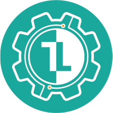

<a name="readme-top"></a>


<br />
<div align="center">
  <a href="https://github.com/TickLabVN/TickFlow-FE">
    
  </a>

<h1 align="center">TickFlow</h1>

  <h2 align="center">
    TickLab manager support application
  </h2>
</div>

<!-- TABLE OF CONTENTS -->
<summary>Table of Contents</summary>
<ol>
  <li>
    <a href="#about-the-project">About The Project</a>
    <ul>
      <li><a href="#built-with">Built with</a></li>
      <li><a href="#built-with">Deploy with</a></li>
    </ul>
  </li>
  <li>
    <a href="#getting-started">Getting Started</a>
    <ul>
      <li><a href="#prerequisites">Prerequisites</a></li>
      <li><a href="#installation-with-yarn">Installation with yarn</a></li>
      <li><a href="#installation-with-docker">Installation with docker</a></li>
      <li><a href="#project-structure">Project structure</a></li>
      <li><a href="#project-configurations">Project configurations</a>
        <ul>
          <li><a href="#code-linting-&-formating">Code linting & formating</a></li>
          <li><a href="#barrelsby-&-path-alias">Barrelsby & Path alias</a></li>
        </ul>
      </li>
    </ul>
  </li>
  <li><a href="#roadmap">Roadmap</a></li>
  <li><a href="#git-working-culture">Git working culture</a></li>
  <li><a href="#contact">Contact</a></li>
</ol>

<!-- ABOUT THE PROJECT -->

# About The Project

This is front-end of Tickflow app. See [TickFlow-Proposal](https://www.overleaf.com/read/fyjqbftxjmhz) for more details about Tickflow.

## Built with

- ReactJS
- Redux-Toolkit
- TailwindCSS
- Flowbite-React
- ViteJS

## Deploy with

- Docker
- Nginx

<!-- GETTING STARTED -->

# Getting Started

## Prerequisites

- `node` v18.15.0
- `yarn` v1.22.19

or if you installed [Docker Engine](https://docs.docker.com/engine/install/):

- `docker` v23.0.1
- `docker compose` v2.16.0

**NOTE**: Fill in `.env` file (use template from `.env.example`) before installing.

## Installation with yarn

1. Install dependencies

```sh
yarn install
```

2. Start project:

```sh
yarn dev
```

## Installation with docker

1. Pull image:

```sh
docker pull ghcr.io/ticklabvn/tickflowfe:latest
```

2. Run container:

```sh
docker compose up -d tickflow-fe
```

## Project structure

```py
📦mock-server                   # include mock-api and simple logic
┣
📦src
 ┣ 📂assets                     # All assets such as jpg, svg, icon ... goes here
 ┣ 📂components                 # Reusable components across the web page
 ┣ 📂constants                  # Contants and routes name
 ┣ 📂interfaces                 # Interfaces of class, function ...
 ┣ 📂pages                      # Screen components
 ┣ 📂services                   # Action to call api from server
 ┣ 📂states                     # Global states
 ┣ 📂types                      # Types for variables, objects ...
 ┣ 📂utils                      # connect to URL server
 ┣ 📜App.tsx                    # App component
 ┗ 📜main.tsx                   # Program entry
 ┗ 📜index.css                  # config tailwindcss
```

## Project configurations

### Code linting & formating

We use [`eslint`](https://eslint.org/) to find and fix problem in code, such as:

- Unused variables
- Use `var` declaration
- Loosely comparation using `==`
- ...

You can run this command to test eslint script:

```bash
yarn lint
```

To maintain only one style coding across members, we use [`prettier`](https://prettier.io/). Try:

```bash
yarn format
```

You don't need to run these scripts regularly or before commiting code. They are run automatically before `git commit` command by setting as a precommit script.

### Barrelsby & Path alias

With configurations in `.barrelsby.json`, barrelsby can import your entire code base in a specific folder, and re-export them in `index.ts` file.  
Try this:

```sh
yarn barrels
```

To avoid using many `..` in relative path, config path alias in `tsconfig.json`. See the guideline [here](https://www.typescriptlang.org/docs/handbook/module-resolution.html#path-mapping).

<!-- ROADMAP -->

## Roadmap

See the [open issues](https://github.com/TickLabVN/TickFlow-FE/issues) for a full list of proposed features (and known issues).

<!-- GIT-WORKING-CULTURE -->

## Git working culture

- For every updates, DO NOT push directly to `main` branch. Create a new branch, commit, publish branch and create a pull request (PR) instead.
- A branch should have prefix `feat/` for a feature update, prefix `hotfix/` for a hotfix, `improve/` for an improvement ...
- A PR should be small enough to review. To split a large PR, use [stacked PRs](https://blog.logrocket.com/using-stacked-pull-requests-in-github/).

<!-- CONTACT -->

## Contact

Nguyễn Phúc Vinh (Mentor) - [github](https://github.com/phucvinh57)

Nguyễn Ngọc Phú (Dev) - [github](https://github.com/ngyngcphu)

Nguyễn Hồng Quân (Dev) - [github](https://github.com/quannhg)

Hoàng Lương (Dev) - [github](https://github.com/hoangluong202)

Nguyễn Thanh Hiền (Project Manager - UI/UX designer) - [github](https://github.com/amyranotamirror)

Project Link: [TickFlow-FE](https://github.com/TickLabVN/TickFlow-FE)

<!-- MARKDOWN LINKS & IMAGES -->
<!-- https://www.markdownguide.org/basic-syntax/#reference-style-links -->

[contributors-shield]: https://img.shields.io/github/contributors/TickLabVN/TickFlow-FE?style=for-the-badge
[contributors-url]: https://github.com/TickLabVN/TickFlow-FE/graphs/contributors
[stars-shield]: https://img.shields.io/github/stars/TickLabVN/TickFlow-FE?style=for-the-badge
[stars-url]: https://github.com/TickLabVN/TickFlow-FE/stargazers
[issues-shield]: https://img.shields.io/github/issues/TickLabVN/TickFlow-FE?style=for-the-badge
[issues-url]: https://github.com/TickLabVN/TickFlow-FE/issues
